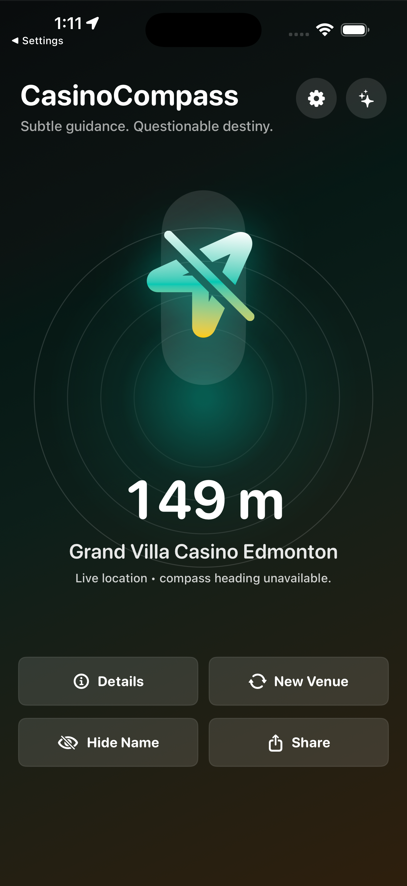
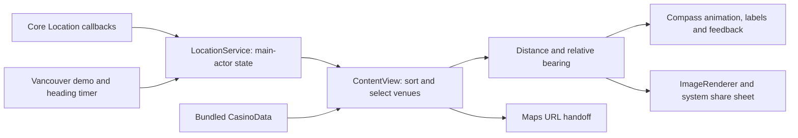

# CasinoCompass

A native iPhone app that points toward the nearest listed casino in a bundled Canadian venue dataset, with explicit notices for venues without live table games. It combines location, device heading, and on-device geometry into a compass with straight-line distance, alternate venues, map handoff, and share cards.

**Swift 6 · SwiftUI · Core Location · iOS 17+ · No backend or third-party SDKs**

## Demo



*Real iPhone 17 Pro Max simulator capture, September 30, 2026. Location is simulated; live heading is explicitly unavailable because the simulator has no compass sensor. This is QA evidence, not physical-device navigation validation.*

Current captures: [Edmonton details](docs/screenshots/edmonton-details.png), [alternate venue](docs/screenshots/edmonton-alternate.png), [Vancouver demo](docs/screenshots/compass-demo.png), [Century Mile notice](docs/screenshots/century-mile.png), [share sheet](docs/screenshots/share-alternate.png), and [Settings](docs/screenshots/settings.png). Raw PNG captures contain alpha and need opaque export or JPEG recapture before App Store upload.

The [Edmonton verification report](docs/EDMONTON_QA.md) records passing builds and lookup checks and the completed release fixes. The [step-by-step App Store guide](docs/APP_STORE_SUBMISSION.md) covers enrollment through release. No App Store submission or launch is established.

## Overview

The product idea is a small, playful location utility for adults and travelers who want to know which direction a nearby casino lies. Instead of browsing a map first, the user sees a pointer and distance, then opens a maps app when they want directions.

The implemented workflow is: acknowledge the age gate → allow location access or use the Vancouver demo → follow the compass → inspect the venue, choose an alternative, or share a distance card. The app performs venue matching locally and has no accounts, betting, payments, advertising, or analytics.

The engineering work in this repository spans native UI, sensor integration, geospatial calculations, selection state, animation, haptics, and UIKit interoperability. The [requirements document](SOFTWARE_REQUIREMENTS.md) contains broader plans; this walkthrough describes the code currently present.

## Key features

- **Location-aware selection:** sorts all bundled casinos by distance and starts with the nearest result. Venues without listed live table games remain selectable with explicit notices; Century Mile is labelled electronic-only.
- **Live directional UI:** calculates bearing relative to device heading, animates across north without a full reverse spin, and fades the background green as alignment improves.
- **Directional feedback:** entering an eight-degree alignment window triggers success feedback and a short sequence of impacts.
- **Nearby alternatives:** cycles through venues within 50 km and explains when the dataset has no additional nearby result.
- **Demo and permission handling:** includes a fixed Vancouver coordinate and simulated heading. Demo stops sensors and ignores live callbacks; backgrounding pauses updates and foregrounding resumes the chosen mode. Live mode waits for a fresh fix and shows unavailable heading rather than animating a fake live direction.
- **Native integrations:** opens Apple Maps or Google Maps and renders a 1080 × 1350 share card. The share payload snapshots nearest/alternate selection, demo mode, name visibility, and table-game notices before the system sheet opens; text remains available if rendering fails.

## Tech stack

| Area | Implementation |
| --- | --- |
| UI and language | Swift 6, SwiftUI, SF Symbols |
| Sensors and geography | Core Location; `CLLocation` distance and custom bearing math |
| State | `@State`, `@StateObject`, `@Published`, `@MainActor` |
| Persistence | `@AppStorage` for age acknowledgement and name visibility; venues compiled into the app |
| Native integration | UIKit haptics and `UIActivityViewController`; SwiftUI `ImageRenderer` |
| External services | URL handoff to maps, website, support, privacy, and safer-play resources |
| Build and tooling | Xcode project; Python standard-library icon generator and README check; GitHub Actions |
| Validation | Simulator and unsigned device builds, standalone Swift regression executable, and manual simulator QA; no XCTest/UI-test target or physical-device validation |

There is no database, server API, package dependency setup, or application hosting configuration.

## How the system works



1. `ContentView` persists the age acknowledgement and starts live mode once after acceptance. Foreground activation resumes the current mode; a cold launch defaults to live mode, with demo fallback when permission is denied.
2. `LocationService` handles authorization and publishes position and heading. Delegate callbacks move state mutations onto the main actor. Accepted fixes require nonnegative horizontal accuracy, a timestamp within 60 seconds, and a timestamp at or after the current live session started. Demo and suspended states reject callbacks.
3. `ContentView` sorts all `CasinoData.venues` by `CLLocation.distance` and takes candidates within 50 km. If none are within that radius, it retains the nearest listed venue. `hasTableGames` now describes live tables rather than controlling eligibility; `hasElectronicTableGames` distinguishes the Century Mile notice.
4. `CompassMath` calculates the initial great-circle bearing and normalizes `bearing − heading` to `[0, 360)`. Distance is straight-line geographic distance, not route distance.
5. `CompassView` converts the normalized angle to a continuous display angle for animation. The parent view computes alignment progress and haptic transitions.
6. Details construct map URLs from the selected venue. Sharing renders a SwiftUI card to an image, with a text fallback if rendering fails.

## Architecture and data model

| File or directory | Responsibility |
| --- | --- |
| [`CasinoCompassApp.swift`](CasinoCompass/CasinoCompassApp.swift) | App entry point and root view |
| [`ContentView.swift`](CasinoCompass/ContentView.swift) | Selection, presentation, age gate, settings, details, map links, and feedback |
| [`LocationService.swift`](CasinoCompass/Services/LocationService.swift) | Authorization, sensors, freshness filtering, demo timer, and published state |
| [`CasinoData.swift`](CasinoCompass/Models/CasinoData.swift) | Canadian venue records and Vancouver demo coordinate |
| [`CasinoVenue.swift`](CasinoCompass/Models/CasinoVenue.swift) | Identifiable venue model, distance, and bearing helpers |
| [`CompassMath.swift`](CasinoCompass/Models/CompassMath.swift) | Bearing, relative angle, and distance formatting |
| [`Views/`](CasinoCompass/Views/) | Compass drawing, share-card layout, and UIKit share-sheet bridge |
| [`CasinoCompass.xcodeproj/`](CasinoCompass.xcodeproj/) | Build settings, signing, deployment target, and generated Info.plist settings |
| [`docs/`](docs/) | Screenshots, privacy policy draft, and release preparation |
| [`tools/`](tools/) | Reproducible icon generation and documentation checks |

`CasinoVenue` contains a stable string ID, name, city, province, address, latitude/longitude, and `hasTableGames` (live tables), and `hasElectronicTableGames`. The current array contains 73 records. There are no entity relationships or remote CRUD endpoints. Live coordinates and selected venue index remain in memory; only two UI preferences use `@AppStorage`.

The age gate is a persisted self-declaration, not identity verification or authentication. Opening maps and sharing are explicit user actions that hand content to another app or service. Venue matching itself makes no backend request and does not persist location history.

## Engineering decisions and tradeoffs

These rationales describe benefits of the implemented approaches, rather than claiming an undocumented history of why they were chosen.

| Decision | Why it fits this implementation | Tradeoff and alternative |
| --- | --- | --- |
| Bundled venue array | Offline lookup, no credentials or server operation, location stays on device during matching | Data changes require an app update. A versioned downloadable dataset could separate content updates from releases. |
| SwiftUI with a main-actor location service | Published sensor state drives declarative views; UI mutations have one isolation boundary | Selection and presentation remain concentrated in `ContentView`. An injected selection model would be easier to test. |
| Bearing plus straight-line distance | Supports a pointer without a routing service | Cannot account for roads, water, or accessibility. Route distance would require a routing integration. |
| Separate normalized and display angles | Keeps geometry bounded while making north-crossing animation continuous | Two representations need boundary tests. Direct normalized-angle animation can spin the long way. |
| Maps via URLs | Uses existing navigation apps without a maps SDK or API key | Handoff behavior belongs to iOS and the destination app. An embedded map would offer more UI control. |

## Technical challenges

### 1. Combining asynchronous sensors with UI state

Core Location provides location, heading, authorization, and errors independently. Delegate methods are `nonisolated` and use `Task { @MainActor in ... }` to update observable state. Heading prefers true north and falls back to magnetic north when true heading is unavailable.

The service owns an explicit mode, stops sensors in demo/background states, and checks mode, activity, and session timestamps before accepting location/heading callbacks. A heading callback never changes the coordinate mode. Live retries show a locating state instead of relabelling demo coordinates. **Interview lesson:** actor isolation protects mutation; explicit mode and event validity checks protect behavior.

### 2. Keeping selection meaningful as position changes

The app resets `selectedVenueIndex` when `locationUpdateID` changes. The service increments that identifier for a first accepted fix or movement of at least 100 m from a movement anchor.

This avoids unconditional resets for every small update; smaller movements accumulate against the anchor until the threshold is reached. Because selection uses an index into a freshly sorted list, the selected identity can also change when ordering changes. **Interview lesson:** stable identity and a well-defined movement anchor matter when collections are recomputed.

### 3. Animating across a circular boundary

A transition from 359° to 2° should move forward 3°, not backward 357°. `CompassView.shortestDelta` wraps the difference to the shortest signed turn, then adds it to an unbounded display angle. **Interview lesson:** mathematical state and animation continuity can need different representations.

### 4. Turning noisy direction data into feedback

The background starts responding inside 45° and reaches full alignment at 8°. Haptics trigger on entry into the alignment window instead of every heading callback. There is no separate exit threshold or cooldown, so jitter around 8° can retrigger feedback. **Interview lesson:** threshold transitions often need hysteresis, not just a Boolean state.

## Deep dive: from a venue to a smooth pointer

Consider a selected venue with a bearing of 2° and a phone heading of 3°:

1. `CasinoVenue.bearing(from:)` delegates to `CompassMath.bearing`. It converts coordinates to radians and uses `atan2` to compute the initial great-circle direction.
2. `relativeAngle(targetBearing:heading:)` normalizes `2 − 3` to 359°. The venue lies one degree left of the phone's heading.
3. If the next sensor update makes the relative angle 2°, `CompassView` calculates a shortest delta of +3° and updates its display angle from 359° to 362°.
4. SwiftUI animates this display angle with a spring while geometry remains normalized. `ContentView.directionError` uses `min(angle, 360 − angle)`, so 359° correctly means a one-degree error.
5. Entering the ≤8° window triggers haptics; the background uses clamped progress between the 45° and 8° thresholds.

The nearest-venue search sorts by distance and filters by radius, approximately O(n log n). More users do not create server contention because each device performs its own lookup. A much larger dataset would stress repeated distance calculations and sorting in computed view properties; caching on position updates or a spatial index would be the next step.

## Running the project

Use macOS and Xcode with Swift 6 and an iOS Simulator runtime. The project was created with Xcode 26.3; the documented simulator build was verified with Xcode 26.3. Deployment targets iPhone on iOS 17.0 or newer.

```sh
git clone https://github.com/mkodithuwakku/CasinoCompass.git
cd CasinoCompass
open CasinoCompass.xcodeproj
```

Select the `CasinoCompass` scheme and an iPhone simulator, then Run. Accept the age gate and deny location permission to explore Vancouver demo mode. The header control switches between live and demo location; foreground activation preserves the selected mode. Live heading is unavailable in the simulator; demo heading is animated and labelled.

No environment variables, API keys, database setup, or package installation are needed. For a physical iPhone, select your own signing team in Xcode and use an available bundle identifier if required; the project currently contains the author's team configuration.

```sh
xcodebuild -project CasinoCompass.xcodeproj \
  -scheme CasinoCompass -configuration Debug \
  -sdk iphonesimulator -derivedDataPath DerivedData build
```

Optional tooling requires Python 3.9+ and uses only its standard library:

```sh
python3 tools/generate_app_icons.py
python3 tools/check_readme_update.py <base-commit> HEAD
```

### Validation

The Debug simulator build and unsigned Release build for generic iOS hardware pass. The privacy manifest is present in both built bundles. `tools/verify_release.sh <booted-simulator-UDID>` compiles the actual app models, location service, and share-card code into a standalone iOS Simulator executable. It checks demo callbacks and resume, stale/background events, permission fallback, eight Edmonton-area selections including Century Mile, share wording/name hiding, and 1080 × 1350 image rendering. This is automated regression coverage, not an XCTest target or physical-device validation.

Manual simulator checks cover nearest/alternate selections, the populated share sheet, demo/live transitions, Century Mile notices, and Settings. Public privacy and support pages are hosted at [GitHub Pages](https://mkodithuwakku.github.io/CasinoCompass/). See [the QA report](docs/EDMONTON_QA.md) for exact evidence and remaining release checks. Signed archive, TestFlight, real GPS/compass/haptics, and App Review remain outstanding.

Before shipping changes, manually exercise the age gate and denied permission, nearest and alternate venues, the single-candidate alert, details, both maps actions, share rendering, and Settings links. Use a physical iPhone to check heading across north, alignment haptics, live/demo transitions, and movement-based selection changes. Test foreground refresh after backgrounding. See the [release checklist](docs/APP_STORE_SUBMISSION.md) for archive and device QA.

## Current limitations and next improvements

1. **Physical-device validation:** run the signed build on an iPhone and TestFlight, including real heading, GPS accuracy, haptics, map destinations, and receiving a shared image. Standalone regression checks and simulator UI checks do not replace this.
2. **Selection identity:** selection still uses an index in a freshly sorted list. Small movements can reorder records; preserve an explicitly selected venue by ID in a future change. The bundled-data fallback assumes a nonempty array.
3. **Data quality:** coverage is static, not exhaustive, and live hours/entrance coordinates are not verified. Century Mile has a dated operator source and explicit electronic-only status; other records retain their existing table-game flags and should be independently audited. A notice reflects the bundled record, not a live venue feed.
4. **Feedback and accessibility:** alignment haptics have no separate exit threshold/cooldown. The main surface scrolls on compact displays; broader larger-text/VoiceOver validation remains useful.
5. **Store submission:** the public pages and UserDefaults privacy manifest are implemented; complete account setup, signing, final screenshots, metadata/age/privacy declarations, and TestFlight before App Review. No App Store publication is claimed.

## Public support website

The static HTML/CSS pages under `docs/` are served by GitHub Pages from `main` → `/docs`, with `.nojekyll` and no custom domain, scripts, analytics, forms, or client storage. The app links to the case-sensitive project URL:

- [Privacy](https://mkodithuwakku.github.io/CasinoCompass/privacy/)
- [Support](https://mkodithuwakku.github.io/CasinoCompass/support/)

Support uses the existing public GitHub Issues page. The website warns that issues are public and require a GitHub account. GitHub's hosting may process technical request data under its own privacy policy. No paid hosting or domain is configured.

The [privacy policy](docs/PRIVACY_POLICY.md) mirrors the public policy, and the [App Store submission guide](docs/APP_STORE_SUBMISSION.md) records remaining steps.

## What this project demonstrates

- Native iOS development with declarative UI and UIKit bridges.
- Integration of asynchronous sensors with main-actor observable state.
- Geospatial math and circular-angle animation.
- Local data modeling, permission handling, and explicit external-app handoff.
- Analysis of real edge cases in selection, sensor lifecycles, and feedback.

## Keeping this README current

Update this walkthrough in the same change set whenever application code, data, assets, configuration, or tooling changes. Revise the affected behavior, architecture, setup, tradeoffs, limitations, and screenshots; for internal changes, record a concise explanation and validation in the maintenance note below.

[`AGENTS.md`](AGENTS.md) makes this part of the coding workflow, and the [pull request template](.github/pull_request_template.md) prompts review. The [README freshness workflow](.github/workflows/readme-freshness.yml) runs on pushes and pull requests and fails when implementation files change without a README edit. It checks the pushed range or PR diff; a newly created ref is compared with an empty tree. Markdown and files under `docs/` are treated as documentation-only changes.

The check detects missing updates, not factual accuracy, and does not write prose automatically. A failed push check reports a problem after the push; blocking merges requires making **Require README update** a required status check in GitHub branch protection. That repository setting is separate from these files.

### Maintenance notes

- Fixed explicit location-mode handling and share presentation/copy; added the bundled UserDefaults privacy manifest and public GitHub Pages resources. Retained Century Mile with an electronic-only notice, refreshed captures, and added executable regression checks. Validation and remaining physical-device limits are described above.

- Reworked this walkthrough against the current Swift sources and build configuration; documented known edge cases and the earlier screenshot's scope. Added repository instructions, a PR checklist, and a GitHub documentation check. Verified the Debug simulator build and exercised the documentation check with passing and failing Git fixtures. No application behavior changed.
