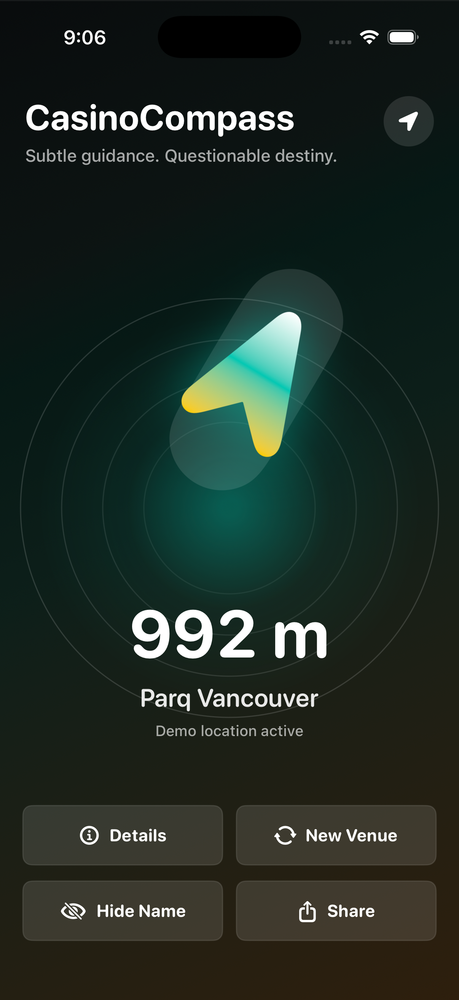

# CasinoCompass

A native iPhone app that points toward the nearest casino with table games in a bundled Canadian venue dataset. It combines location, device heading, and on-device geometry into a compass with straight-line distance, alternate venues, map handoff, and share cards.

**Swift 6 · SwiftUI · Core Location · iOS 17+ · No backend or third-party SDKs**

## Demo



*Real simulator capture from an earlier revision. It demonstrates the core workflow but predates the current Settings button and rotating taglines; it is not a current release screenshot.*

Current screenshots still needed in `docs/screenshots/`:

| File to capture | State to show |
| --- | --- |
| `compass-demo.png` | Current main screen, Vancouver demo mode, nearest venue and distance visible |
| `venue-details.png` | The same venue's address, distance, and both map actions |
| `alternate-venue.png` | After tapping New Venue, with the alternate-selection label visible |
| `settings.png` | Privacy, support, and safer-play resources |

Use demo coordinates for reproducible captures and replace the earlier image above after capturing the current build. The repository includes release preparation documents; it does not establish an App Store launch.

## Overview

The product idea is a small, playful location utility for adults and travelers who want to know which direction a nearby casino lies. Instead of browsing a map first, the user sees a pointer and distance, then opens a maps app when they want directions.

The implemented workflow is: acknowledge the age gate → allow location access or use the Vancouver demo → follow the compass → inspect the venue, choose an alternative, or share a distance card. The app performs venue matching locally and has no accounts, betting, payments, advertising, or analytics.

The engineering work in this repository spans native UI, sensor integration, geospatial calculations, selection state, animation, haptics, and UIKit interoperability. The [requirements document](SOFTWARE_REQUIREMENTS.md) contains broader plans; this walkthrough describes the code currently present.

## Key features

- **Location-aware selection:** filters for table-game venues, sorts by distance, and starts with the nearest result.
- **Live directional UI:** calculates bearing relative to device heading, animates across north without a full reverse spin, and fades the background green as alignment improves.
- **Directional feedback:** entering an eight-degree alignment window triggers success feedback and a short sequence of impacts.
- **Nearby alternatives:** cycles through venues within 50 km and explains when the dataset has no additional nearby result.
- **Demo and permission handling:** includes a fixed Vancouver coordinate and simulated heading for exploring the UI without live sensors.
- **Native integrations:** opens Apple Maps or Google Maps and renders a 1080 × 1350 share card through the system share sheet.

## Tech stack

| Area | Implementation |
| --- | --- |
| UI and language | Swift 6, SwiftUI, SF Symbols |
| Sensors and geography | Core Location; `CLLocation` distance and custom bearing math |
| State | `@State`, `@StateObject`, `@Published`, `@MainActor` |
| Persistence | `@AppStorage` for age acknowledgement and name visibility; venues compiled into the app |
| Native integration | UIKit haptics and `UIActivityViewController`; SwiftUI `ImageRenderer` |
| External services | URL handoff to maps, website, support, privacy, and safer-play resources |
| Build and tooling | Xcode project; Python standard-library icon generator and README check; GitHub Actions |
| Validation | Simulator build and manual QA; no XCTest or UI-test target yet |

There is no database, server API, package dependency setup, or application hosting configuration.

## How the system works


1. `ContentView` persists the age acknowledgement and requests a location refresh after acceptance and on foreground activation.
2. `LocationService` handles authorization and publishes position and heading. Delegate callbacks move state mutations onto the main actor. Accepted fixes require nonnegative horizontal accuracy and a timestamp within 60 seconds of now.
3. `ContentView` filters `CasinoData.venues` by `hasTableGames`, sorts by `CLLocation.distance`, and takes candidates within 50 km. If none are within that radius, it retains the nearest qualifying venue.
4. `CompassMath` calculates the initial great-circle bearing and normalizes `bearing − heading` to `[0, 360)`. Distance is straight-line geographic distance, not route distance.
5. `CompassView` converts the normalized angle to a continuous display angle for animation. The parent view computes alignment progress and haptic transitions.
6. Details construct map URLs from the selected venue. Sharing renders a SwiftUI card to an image, with a text fallback if rendering fails.

## Architecture and data model

| File or directory | Responsibility |
| --- | --- |
| [`CasinoCompassApp.swift`](CasinoCompass/CasinoCompassApp.swift) | App entry point and root view |
| [`ContentView.swift`](CasinoCompass/ContentView.swift) | Selection, presentation, age gate, settings, details, map links, and feedback |
| [`LocationService.swift`](CasinoCompass/Services/LocationService.swift) | Authorization, sensors, freshness filtering, demo timer, and published state |
| [`CasinoData.swift`](CasinoCompass/Models/CasinoData.swift) | Canadian venue records and Vancouver demo coordinate |
| [`CasinoVenue.swift`](CasinoCompass/Models/CasinoVenue.swift) | Identifiable venue model, distance, and bearing helpers |
| [`CompassMath.swift`](CasinoCompass/Models/CompassMath.swift) | Bearing, relative angle, and distance formatting |
| [`Views/`](CasinoCompass/Views/) | Compass drawing, share-card layout, and UIKit share-sheet bridge |
| [`CasinoCompass.xcodeproj/`](CasinoCompass.xcodeproj/) | Build settings, signing, deployment target, and generated Info.plist settings |
| [`docs/`](docs/) | Screenshots, privacy policy draft, and release preparation |
| [`tools/`](tools/) | Reproducible icon generation and documentation checks |

`CasinoVenue` contains a stable string ID, name, city, province, address, latitude/longitude, and `hasTableGames`. The current array contains 73 records. There are no entity relationships or remote CRUD endpoints. Live coordinates and selected venue index remain in memory; only two UI preferences use `@AppStorage`.

The age gate is a persisted self-declaration, not identity verification or authentication. Opening maps and sharing are explicit user actions that hand content to another app or service. Venue matching itself makes no backend request and does not persist location history.

## Engineering decisions and tradeoffs

These rationales describe benefits of the implemented approaches, rather than claiming an undocumented history of why they were chosen.

| Decision | Why it fits this implementation | Tradeoff and alternative |
| --- | --- | --- |
| Bundled venue array | Offline lookup, no credentials or server operation, location stays on device during matching | Data changes require an app update. A versioned downloadable dataset could separate content updates from releases. |
| SwiftUI with a main-actor location service | Published sensor state drives declarative views; UI mutations have one isolation boundary | Selection and presentation remain concentrated in `ContentView`. An injected selection model would be easier to test. |
| Bearing plus straight-line distance | Supports a pointer without a routing service | Cannot account for roads, water, or accessibility. Route distance would require a routing integration. |
| Separate normalized and display angles | Keeps geometry bounded while making north-crossing animation continuous | Two representations need boundary tests. Direct normalized-angle animation can spin the long way. |
| Maps via URLs | Uses existing navigation apps without a maps SDK or API key | Handoff behavior belongs to iOS and the destination app. An embedded map would offer more UI control. |

## Technical challenges

### 1. Combining asynchronous sensors with UI state

Core Location provides location, heading, authorization, and errors independently. Delegate methods are `nonisolated` and use `Task { @MainActor in ... }` to update observable state. Heading prefers true north and falls back to magnetic north when true heading is unavailable.

The service rejects stale fixes and retains the last known position on some failures. It does not fully separate demo and live callbacks, so actor isolation alone does not solve mode-transition races. **Interview lesson:** safe mutation and correct event ordering are separate concerns.

### 2. Keeping selection meaningful as position changes

The app resets `selectedVenueIndex` when `locationUpdateID` changes. The service increments that identifier for a first accepted fix or movement of at least 100 m from the immediately previous accepted fix.

This avoids unconditional resets for every small update, but successive smaller movements do not accumulate toward the threshold. Because selection uses an index into a freshly sorted list, the selected identity can also change when ordering changes. **Interview lesson:** stable identity and a well-defined movement anchor matter when collections are recomputed.

### 3. Animating across a circular boundary

A transition from 359° to 2° should move forward 3°, not backward 357°. `CompassView.shortestDelta` wraps the difference to the shortest signed turn, then adds it to an unbounded display angle. **Interview lesson:** mathematical state and animation continuity can need different representations.

### 4. Turning noisy direction data into feedback

The background starts responding inside 45° and reaches full alignment at 8°. Haptics trigger on entry into the alignment window instead of every heading callback. There is no separate exit threshold or cooldown, so jitter around 8° can retrigger feedback. **Interview lesson:** threshold transitions often need hysteresis, not just a Boolean state.

## Deep dive: from a venue to a smooth pointer

Consider a selected venue with a bearing of 2° and a phone heading of 3°:

1. `CasinoVenue.bearing(from:)` delegates to `CompassMath.bearing`. It converts coordinates to radians and uses `atan2` to compute the initial great-circle direction.
2. `relativeAngle(targetBearing:heading:)` normalizes `2 − 3` to 359°. The venue lies one degree left of the phone's heading.
3. If the next sensor update makes the relative angle 2°, `CompassView` calculates a shortest delta of +3° and updates its display angle from 359° to 362°.
4. SwiftUI animates this display angle with a spring while geometry remains normalized. `ContentView.directionError` uses `min(angle, 360 − angle)`, so 359° correctly means a one-degree error.
5. Entering the ≤8° window triggers haptics; the background uses clamped progress between the 45° and 8° thresholds.

The nearest-venue search is a filter plus sort, approximately O(n log n). More users do not create server contention because each device performs its own lookup. A much larger dataset would stress repeated distance calculations and sorting in computed view properties; caching on position updates or a spatial index would be the next step.

## Running the project

Use macOS and Xcode with Swift 6 and an iOS Simulator runtime. The project was created with Xcode 26.3; the documented simulator build was verified with Xcode 26.3. Deployment targets iPhone on iOS 17.0 or newer.

```sh
git clone https://github.com/mkodithuwakku/CasinoCompass.git
cd CasinoCompass
open CasinoCompass.xcodeproj
```

Select the `CasinoCompass` scheme and an iPhone simulator, then Run. Accept the age gate and deny location permission to explore Vancouver demo mode. The header control switches between live and demo location; foreground activation attempts a live refresh again.

No environment variables, API keys, database setup, or package installation are needed. For a physical iPhone, select your own signing team in Xcode and use an available bundle identifier if required; the project currently contains the author's team configuration.

```sh
xcodebuild -project CasinoCompass.xcodeproj \
  -scheme CasinoCompass -configuration Debug \
  -sdk iphonesimulator -derivedDataPath DerivedData build
```

Optional tooling requires Python 3.9+ and uses only its standard library:

```sh
python3 tools/generate_app_icons.py
python3 tools/check_readme_update.py <base-commit> HEAD
```

### Validation

The Debug simulator build passes. There is no automated application test target; the build check does not validate sensor behavior or interactions.

Before shipping changes, manually exercise the age gate and denied permission, nearest and alternate venues, the single-candidate alert, details, both maps actions, share rendering, and Settings links. Use a physical iPhone to check heading across north, alignment haptics, live/demo transitions, and movement-based selection changes. Test foreground refresh after backgrounding. See the [release checklist](docs/APP_STORE_SUBMISSION.md) for archive and device QA.

## Current limitations and next improvements

1. **Tests and testability:** add unit tests for bearing, circular-angle boundaries, distance formatting, selection, and freshness; introduce injectable location events and selection logic before UI tests.
2. **Location lifecycle:** switching to demo does not stop live updates or reject subsequent live callbacks. The demo timer also has no explicit shutdown. Separate mode from sensor availability, stop unused updates, and test foreground/background transitions.
3. **Selection correctness:** accumulate movement from a reset anchor and preserve an explicitly selected venue by ID. The empty-array fallback indexes the first dataset entry and assumes the bundle is nonempty.
4. **Share-card accuracy:** the card always says “closest casino,” even after choosing an alternate; it also omits the demo-mode distinction. Make the text reflect the selected result and location mode.
5. **Data quality:** bundled records have no per-venue source or last-verified date. Audit coordinates and table-game eligibility, preserve stable IDs, and describe missing nearby results as dataset limitations.
6. **Presentation and release readiness:** capture current screenshots, verify compact-screen and larger-text layouts, and finish publishing the configured privacy/support pages. Their availability is not established by the repository. Some taglines imply favorable odds and should be reviewed against the project's own responsible-use positioning.

The [privacy policy](docs/PRIVACY_POLICY.md) and [App Store submission notes](docs/APP_STORE_SUBMISSION.md) are preparation materials. The requirements include future backend and monetization ideas that are not implemented.

## What this project demonstrates

- Native iOS development with declarative UI and UIKit bridges.
- Integration of asynchronous sensors with main-actor observable state.
- Geospatial math and circular-angle animation.
- Local data modeling, permission handling, and explicit external-app handoff.
- Analysis of real edge cases in selection, sensor lifecycles, and feedback.

## Keeping this README current

Update this walkthrough in the same change set whenever application code, data, assets, configuration, or tooling changes. Revise the affected behavior, architecture, setup, tradeoffs, limitations, and screenshots; for internal changes, record a concise explanation and validation in the maintenance note below.

[`AGENTS.md`](AGENTS.md) makes this part of the coding workflow, and the [pull request template](.github/pull_request_template.md) prompts review. The [README freshness workflow](.github/workflows/readme-freshness.yml) runs on pushes and pull requests and fails when implementation files change without a README edit. It checks the pushed range or PR diff; a newly created ref is compared with an empty tree. Markdown and files under `docs/` are treated as documentation-only changes.

The check detects missing updates, not factual accuracy, and does not write prose automatically. A failed push check reports a problem after the push; blocking merges requires making **Require README update** a required status check in GitHub branch protection. That repository setting is separate from these files.

### Maintenance notes

- Reworked this walkthrough against the current Swift sources and build configuration; documented known edge cases and the earlier screenshot's scope. Added repository instructions, a PR checklist, and a GitHub documentation check. Verified the Debug simulator build and exercised the documentation check with passing and failing Git fixtures. No application behavior changed.
